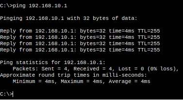
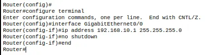
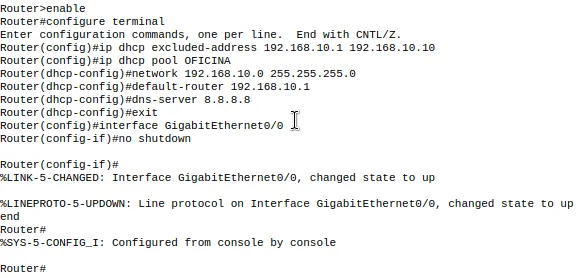
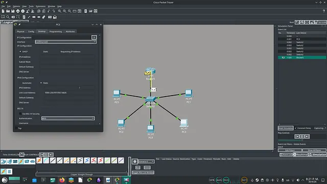

# IMPLEMENTACION Y ANÁLISIS DE SERVICIOS DHCP EN ENTORNOS VIRTUALIZADOS: UN ENFOQUE TÉCNICO EN OPENSUSE TUMBLEWEED
---
**Autor**: Iktan **Fecha**: 30 de abril de 2026

**Entorno**: openSUSE Tumbleweed | KDE Plasma | Wayland

**Herramientas de despliegue**: Podman (Rootless), Distrobox

## 1. Enfoque práctico de la infraestructura

Para la realización de esta práctica de redes, se implementó un entorno de laboratorio sobre **openSUSE Tumbleweed**, utilizando una arquitectura basada en contenedores (Distrobox gestionado por Podman).

Este enfoque no solo responde a la necesidad de ejecutar herramientas como Cisco Packet Tracer, sino que actúa como **una solución de innovación digital ante limitaciones de compatibilidad de software**, especialmente en entornos rolling-release.

Mediante esta implementación se logra:

- Aislar dependencias sin comprometer el sistema anfitrión.
- Ejecutar aplicaciones legadas en un entorno controlado.
- Mantener la estabilidad del laboratorio a pesar de actualizaciones constantes del sistema.

De esta forma, la práctica no se limita al protocolo de red, sino que también valida un enfoque moderno de despliegue basado en contenedores.

## 2. Objetivo de la práctica

El objetivo principal es configurar y verificar un servidor DHCP en un router Cisco, permitiendo la asignación dinámica de direcciones IP en una red local.

De manera complementaria, la práctica busca demostrar cómo es posible superar limitaciones técnicas mediante soluciones de virtualización ligera, integrando herramientas no nativas dentro de un entorno moderno.


## 3. Desarrollo de la práctica

Siguiendo los lineamientos del laboratorio, se implementó una topología compuesta por:

La red utilizada fue **192.168.10.0/24**, con el router como gateway **(192.168.10.1)**.

### Configuración del servidor DHCP (Cisco IOS)

```
Router> enable
Router# configure terminal

Router(config)# ip dhcp excluded-address 192.168.10.1 192.168.10.10

Router(config)# ip dhcp pool OFICINA
Router(dhcp-config)# network 192.168.10.0 255.255.255.0
Router(dhcp-config)# default-router 192.168.10.1
Router(dhcp-config)# dns-server 8.8.8.8
```

### Configuración de la interfaz del router:


```
Router(config)# interface g0/0
Router(config-if)# ip address 192.168.10.1 255.255.255.0
Router(config-if)# no shutdown
```


## 4. Ejecución de la práctica

Durante la ejecución:

- Las PCs se configuraron en modo automático (DHCP).
- El router asignó direcciones IP dentro del rango disponible.
- Se excluyeron las primeras 10 direcciones para evitar conflictos.

Se verificó que cada cliente recibió correctamente:

- Dirección IP válida
- Puerta de enlace
- Servidor DNS

Finalmente, se comprobó la conectividad mediante pruebas de **ping al gateway**, validando el funcionamiento del servicio.

### 5. Resultados de la práctica

La práctica permitió:

- Validar el funcionamiento del protocolo DHCP en un entorno controlado.
- Confirmar la correcta asignación dinámica de parámetros de red.
- Comprobar la conectividad entre clientes y servidor.

Adicionalmente, se demostró que el uso de **openSUSE Tumbleweed junto con contenedores** permite implementar soluciones funcionales frente a limitaciones de compatibilidad, integrando herramientas legadas dentro de infraestructuras modernas.

Este enfoque evidencia que la capacidad técnica no depende únicamente del entorno nativo, sino de la habilidad para **adaptar el ecosistema mediante estrategias de innovación digital**, logrando entornos de laboratorio más flexibles, portables y resilientes.

> CAPTURAS DE PANTALLA

  

