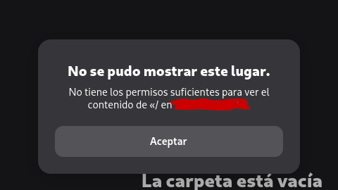
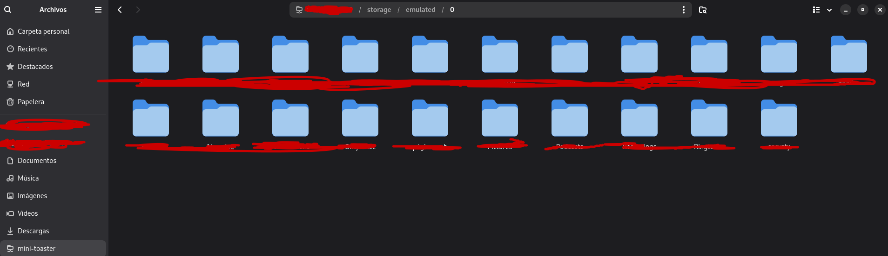

# SOLUCIÓN DEL ERROR AL MONTAR EL SISTEMA DE ARCHIVOS EN LA EXTENSIÓN GSCONNECT

---

En esta documentación se explica un curioso error que se identificó al usar la extensión GSConnect relacionado con el sistema de archivos:

---

## EXPLICACIÓN

Este error tiene una explicación sencilla: **¡NO ES UN ERROR DE LA EXTENSIÓN!** Sí, así como lo lee. Pasé casi una hora pensando que el error estaba en la extensión o en el sistema, pero todo se resume a una característica de seguridad de Android.

Verán, Nautilus usa `GVFS` para montar el sistema de archivos del teléfono. Cuando haces clic en el icono integrado de GSConnect, la extensión de GNOME ejecuta una llamada estándar del tipo `gio mount sftp://TU_IP:1739/`. Básicamente no especifica una subcarpeta y Android, en sus versiones más recientes, bloquea el directorio raíz, causando el mensaje de error de permisos.

---

## SOLUCIÓN

La solución es muy sencilla: **se debe especificar una subcarpeta**, la cual será `/storage/emulated/0`, quedando una estructura como la siguiente: `sftp://TU_IP:1739/storage/emulated/0`.

Por último, solo haces un marcador desde Nautilus a esta dirección para tenerlo anclado.

