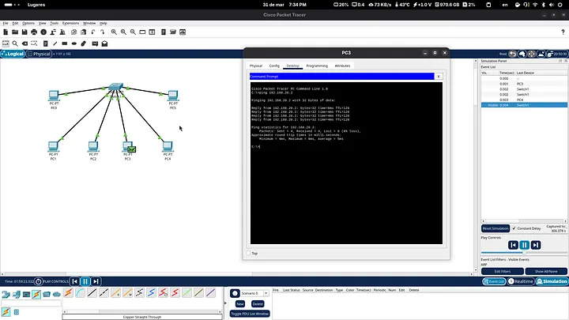

# SEGMENTACIÓN DE REDES: MI EXPERIENCIA CONFIGURANDO VLANS EN CISCO IOS

---

Recientemente finalicé una práctica fundamental en el despliegue de redes: la implementación de VLANs (Virtual Local Area Networks). Para quienes estamos inmersos en el mundo de las TIC, pasar de una red plana a una segmentada es el primer paso real hacia una infraestructura profesional, resiliente y, sobre todo, segura.

Aquí detallo el proceso técnico, la lógica detrás de los comandos y los resultados obtenidos en este laboratorio de Capa 2.

## El problema: El Dominio de Difusión Único

En una red física estándar, todos los dispositivos comparten un mismo dominio de broadcast. Esto no solo es un riesgo de seguridad (Ventas pudiendo “escuchar” a Ingeniería), sino un desperdicio de recursos de red. Mi objetivo fue dividir un switch físico Cisco 2960 en dos redes lógicas independientes.

## Escenario de Trabajo

### Segmentacion Ventas (VLAN 10)

- **Red**: 192.168.10.0/24
- **Interfaces**: FastEthernet 0/1 al 0/3
- **Hosts**: PC 1 (.1), PC 2 (.2) Y PC 3. (.3)

## Implementación Técnica (Cisco CLI)

Como entusiasta de la terminal, prefiero la precisión de la CLI sobre cualquier interfaz gráfica. La configuración se divide en tres bloques lógicos:

## 1. Para Ventas (VLAN 10):

Lo primero es declarar las VLANs en el switch. Sin este paso, el switch no reconocerá el etiquetado de los marcos (frames).


```cisco cli
Switch(config)# vlan 10
Switch(config-vlan)# name Ventas
Switch(config)# vlan 20
Switch(config-vlan)# name Ingenieria
```


## 2. Configuración de Puertos de Acceso

Utilicé el comando interface range para optimizar el tiempo de configuración. Es vital definir el modo de puerto como access para asegurar que estas interfaces transporten solo el tráfico de una VLAN específica.

**Para Ventas (VLAN 10)**: 

```cicos cli
Switch(config)# interface range fa0/4 - 6
Switch(config-if-range)# switchport mode access
Switch(config-if-range)# switchport access vlan 20
```

## Verificación de Aislamiento en Capa 2

La prueba de fuego en cualquier despliegue de infraestructura es el comando ```ping``` (ICMP).


- **Intra-VLAN**: Al realizar un ping entre PC0 y PC2 (ambos en la VLAN 10), la respuesta fue exitosa con tiempos de latencia mínimos. La comunicación fluye correctamente dentro del segmento.

- **Inter-VLAN**: Al intentar alcanzar la PC3 (Ingeniería) desde la PC0 (Ventas), el resultado fue un “Request timed out”.

Este “fallo” de comunicación es, en realidad, un éxito rotundo: el aislamiento de Capa 2 es total. Sin un dispositivo de Capa 3 (un router o un switch multilayer) que gestione el ruteo inter-VLAN, ambos departamentos son invisibles entre sí.

## Conclusión

Implementar VLANs no es solo “separar cables virtuales”; es gestionar el tráfico de manera inteligente. Con esta práctica, logré optimizar el ancho de banda al reducir los dominios de difusión y establecí un perímetro de seguridad básico pero efectivo.

Como estudiante de infraestructura, este tipo de ejercicios refuerzan que la verdadera potencia de una red no está en el hardware más moderno, sino en una configuración lógica bien estructurada.

---
# IMAGEN DE EJEMPLO
